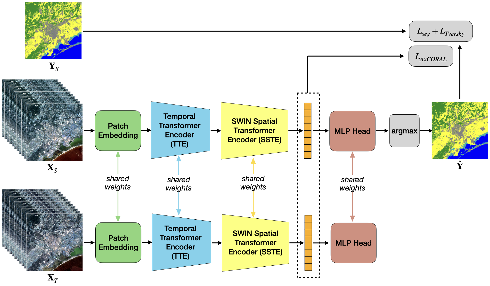

# MACFLY: Multi-temporal Unsupervised Domain Adaptation via Coral-based Feature Alignment for Land Cover Mapping Across Years

## Overview



MACFLY is an Unsupervised Domain Adaptation (UDA) framework for dense semantic segmentation of Landsat Satellite Image Time Series (SITS) under cross-year temporal transfer. Given a labelled land cover map for a source year, MACFLY produces dense segmentation maps for a target year lacking ground truth, using only Landsat SITS as input, without any additional supervision.

The framework addresses three core challenges of cross-year transfer in remote sensing:
- Inter-annual phenological and climatic variability
- Cross-sensor radiometric discrepancies (e.g., Landsat 5 TM vs. Landsat 7 ETM+)
- Severe land-cover class imbalance

MACFLY builds on a SWIN-enhanced TSViT backbone and combines two complementary adaptation mechanisms: an **axial CORAL loss** for second-order feature covariance alignment, and a **Rare Class Sampling (RCS)** strategy to stabilise minority classes during training.

> **Paper:** *Back to the Past: Cross-Year Unsupervised Domain Adaptation for Dense Land Cover Segmentation from Satellite Image Time Series* —under review.

---


### Expected data format

MACFLY expects pre-extracted patches stored as `.npy` arrays:

| File | Shape | Description |
|---|---|---|
| `landsat_patches.npy` | `(N, T, S+1, H, W)` | Landsat SITS monthly composites (T=12, S=6 bands + DOY) |
| `glc_patches.npy` | `(N, H, W)` | GLC_FCS30D land-cover labels (source year only) |

Patches are non-overlapping 64×64 pixel tiles at 30 m resolution. Raw Landsat imagery should be downloaded from the [Microsoft Planetary Computer](https://planetarycomputer.microsoft.com/) and composited using monthly median aggregation in Google Earth Engine before patch extraction.

---

## Installation

```bash
conda create -n macfly-env \
    python=3.9 \
    numpy=1.26.4 \
    pytorch=2.1 \
    torchvision \
    torchaudio \
    pytorch-cuda=11.8 \
    rasterio \
    fiona \
    shapely \
    tqdm \
    timm \
    -c pytorch -c nvidia -c conda-forge

conda activate macfly-env
```

---

## Usage

### Training

The main training script launches UDA between a source year (labelled) and a target year (unlabelled) for a given city:

```bash
python main.py -c <city> -yr <source_year> <target_year> -e <epochs> -n_gpu <gpu_id>
```

**Example — forward transfer (1995 → 2000):**
```bash
python main.py -c Montpellier -yr 1995 2000 -e 500 -n_gpu 0
```

**Example — backward transfer (2000 → 1995):**
```bash
python main.py -c Wuhan -yr 2000 1995 -e 500 -n_gpu 1
```

**Full list of arguments:**

| Argument | Default | Description |
|---|---|---|
| `-c`, `--city` | required | City name (must match a sub-directory in `data_output/`) |
| `-yr`, `--years` | required | Source and target years (e.g., `1995 2000`) |
| `-e`, `--epochs` | `500` | Total number of training epochs |
| `-n_gpu`, `--gpu_number` | `0` | CUDA device index |
| `-o`, `--out_dir` | `Results` | Output directory for checkpoints and predictions |
| `-ds`, `--ds_dir` | `./` | Root directory of the dataset |
| `--axial_coral` | `True` | Enable axial CORAL alignment loss |
| `--global_coral` | `False` | Enable global CORAL alignment loss (alternative to axial) |
| `--no_tversky` | `False` | Disable the Tversky loss term |

Checkpoints and georeferenced prediction GeoTIFFs are saved automatically under `Results/<city>/` at the end of each training chunk (every 500 epochs by default).

---

### Inference

To run inference on a single year using a saved checkpoint, use the utilities in `uda_test.py`:

```python
from uda_test import inference_teacher_timeseries, save_georeferenced_tiff

prediction = inference_teacher_timeseries(
    teacher=teacher,          # loaded model
    year_dir="data_input/Montpellier/1995/000001",
    device="cuda",
    num_classes=10,
    patch_size=64,
    overlap=16,
)

save_georeferenced_tiff(
    prediction=prediction,
    reference_raster_path="path/to/reference.tif",
    out_path="prediction_1995.tif",
    crop_border=0,
)
```

---

## Land Cover Classes

MACFLY maps 10 macro-classes derived from the GLC_FCS30D taxonomy:

| ID | Class |
|---|---|
| 0 | Cropland |
| 1 | Forest |
| 2 | Shrubland |
| 3 | Grassland |
| 4 | Tundra |
| 5 | Wetland |
| 6 | Impervious Surface |
| 7 | Bare Areas |
| 8 | Water Body |
| 9 | Permanent Snow and Ice |

---

## Citation

If you use MACFLY in your research, please cite:

```bibtex
@article{guarino2025macfly,
  title     = {Back to the Past: Cross-Year Unsupervised Domain Adaptation
               for Dense Land Cover Segmentation from Satellite Image Time Series},
  author    = {Guarino, Giuseppe and Jabea, Christopher and Dantas, C{\'a}ssio F.
               and Ienco, Dino and Gaetano, Raffaele and Interdonato, Roberto
               and Ciotola, Matteo and Cernesson, Flavie and Barbe, Eric
               and Gui{\`e}ant, Nadia and Weber, Christiane},
  journal   = {},
  year      = {2025},
  note      = {Under review}
}
```
# MACFLY
